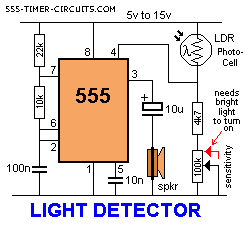

# LED Light Sensor Circuit

I'm going to be building an LED light sensor circuit because I found it online. I plan on having two LED that detects darkness. Referencing schematics from various sources.

## April 5th, 2026 - Researching

Today I worked on finding schematic ideas. From this website https://www.555-timer-circuits.com/light-detector.html I found a light detector circuit using speakers. I don't want speakers so I'm going to replace it with a resistor and LED. I will also observe Pin 3 and see if it would work.

Orginally I wanted to go with one LED because it was simple. Now that I think about it I could just add another LED in parallel. If I had a breadboard I can test it but I am only going to test through theory for now.

I followed the diagram but I ran to a problem, my pins are not in the same orientation as it is in the picture so I had to reroute my wiring so that it can match the pinouts. Pin 3 is output so it should be ok!

I don't like how my schematic looks in my opinion and I really want to clean it up, but the LDR photo resistor should stay between pin 4 and 8 so that's why I designed it that way. Maybe it would be ok but I'll check the datasheet.

1[image](attacments/image1.png)

### Time Spent: 1 Hours